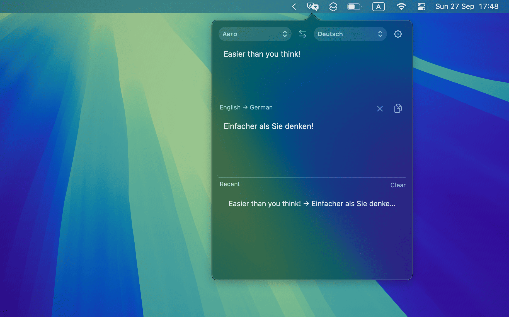

# Translate Bar

**Easier than you think!**

A minimalist menu bar translator for macOS. Click the icon, type, get the translation — no windows in the Dock, no clutter.



## Features

- Lives in the menu bar (no Dock icon)
- 12 target languages, source language detection or manual selection with one-click swap
- One-click translation history with reuse
- Interface in Russian or English (follows the system language by default)
- Free, no API keys, translation history stored locally on your Mac

## Requirements

- macOS 13 Ventura or later
- Apple Silicon (arm64)
- Internet connection (translations use Google / MyMemory online services)

## Install

1. Download `TranslateBar-1.0-arm64.dmg` from the [Releases](../../releases) page.
2. Open it and drag **Translate Bar.app** into **Applications**.
3. Launch it. On the first run macOS will warn about an unsigned developer — right-click the app → **Open** to confirm.

## Run from source

```bash
python3 -m venv .venv
.venv/bin/python -m pip install -r requirements.txt
.venv/bin/python menubar.py
```

## Build from source

```bash
.venv/bin/python -m pip install -r requirements.txt -r requirements-build.txt
.venv/bin/pyinstaller -y TranslateBar.spec
# .app appears in dist/
```

To make a DMG (requires [create-dmg](https://github.com/create-dmg/create-dmg)):

```bash
create-dmg --volname "Translate Bar" --window-size 520 340 --icon-size 96 \
  --icon "Translate Bar.app" 140 170 --app-drop-link 380 170 \
  "TranslateBar-1.0-arm64.dmg" "dist/Translate Bar.app"
```

## Privacy

No accounts, no tracking, no API keys. Translation requests go to public translation services; history and settings live only in `~/Library/Application Support/Translate Bar/` on your Mac.

## License

MIT — see [LICENSE](LICENSE).
